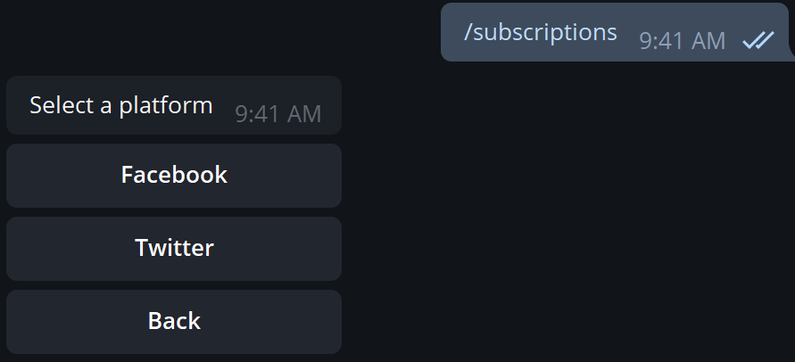
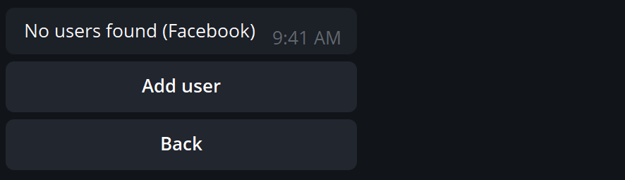
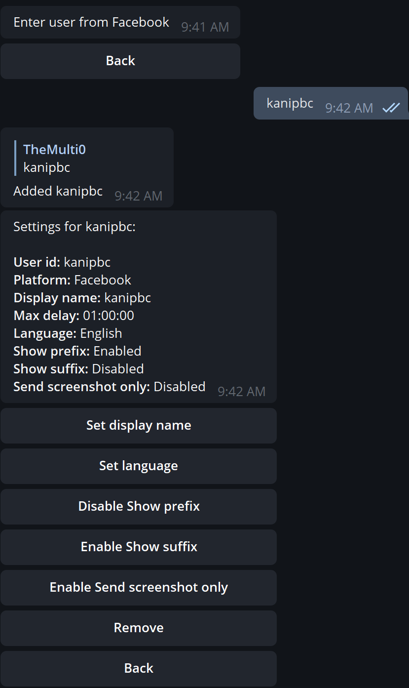

# Configuring subscriptions

In this tutorial we will configure Iris to send us all the updates of the Facebook user [kanipbc](https://www.facebook.com/kanipbc/).

First, we will start a conversation with [@IrisUpdateBot](https://t.me/irisupdatebot).

In order to configure subscriptions we will send Iris the command `/subscriptions`.
<figure>
  
</figure>
 

Then, we will select 'Facebook'.
<figure>
  
</figure>
 

Now, we can press 'Add user' and send out the name of the user we want to add.
<figure>
  
</figure>