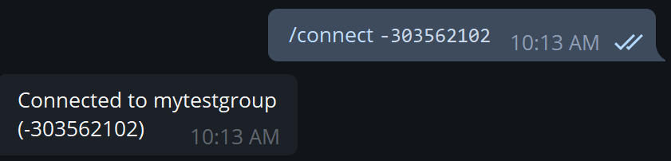

# Connecting to external chats

In this tutorial we will configure Iris to send us all subscription updates in a custom group.
The same functionality can be acheieved when adding Iris to a channel.

First, we will start a conversation with [@IrisUpdateBot]("https://t.me/irisupdatebot")

In order to control the subscriptions of a different chat, we must add Iris to it.

Then we will send Iris the command `/connect <chatid>`
> Note: For public groups\channel, make sure you pass the chatid as '@chat', for example: '@irisupdatebotnews'

<figure>
  
</figure>
 

If we send `/subscriptions`, we will see that Iris's subscriptions are different per-chat.
<figure>
  
</figure>
 

We can always send `/disconnect` to manage the private conversation with Iris and `/connection` to see current connection.
<figure>
  
</figure>