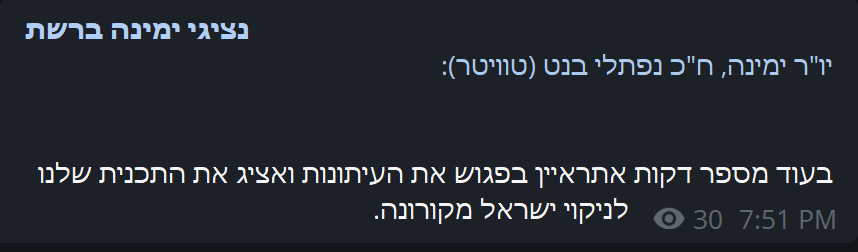
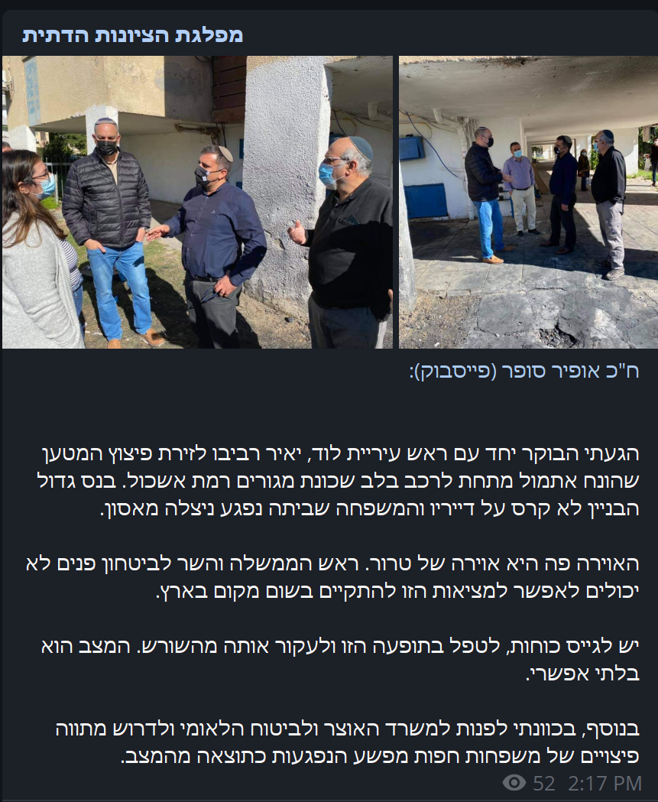

# Home

This is Iris - an automatic social-media update bot!

Iris lets you subscribe to custom users over a variety of platforms, then receive their latest updates!

## Supported platforms
 - Facebook
 - Twitter

## Examples

Iris can send many different type of updates to Telegram, making them look completely native!
Here are some examples:
<figure>
  
  <figcaption>Text updates</figcaption>
</figure>

<figure>
  
  <figcaption>Photo album updates</figcaption>
</figure>

<figure>
  
  <figcaption>Video updates</figcaption>
</figure>

<figure>
  
  <figcaption>Livestream updates</figcaption>
</figure>